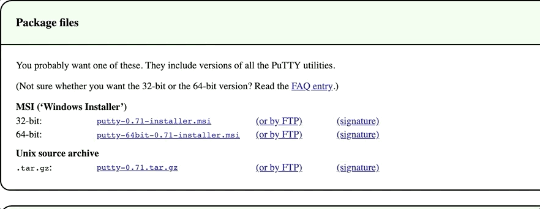
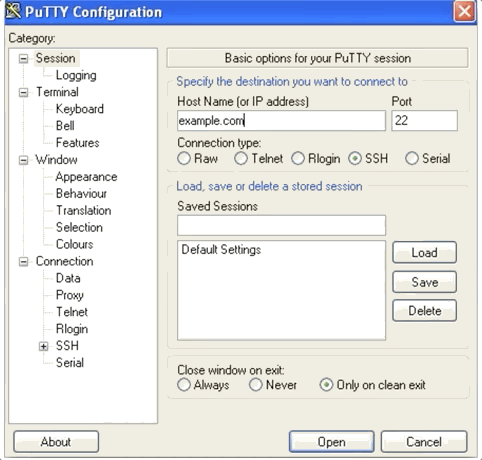

# How to set up ssh keys and login into server

Tips: 
  - CLI: Command Line interface. Run program on the terminal
  - flags: Example `-p`. Additional arguments for the cli.

For more in depth tutorial via [https://www.digitalocean.com/docs/droplets/how-to/add-ssh-keys/](https://www.digitalocean.com/docs/droplets/how-to/add-ssh-keys/)

## [ Windows ]

Download putty

[putty](https://www.chiark.greenend.org.uk/~sgtatham/putty/latest.html) <----- Download Here

 

Open and login using putty

 

Generate Private and public key for ssh server

[https://www.digitalocean.com/docs/droplets/how-to/add-ssh-keys/create-with-putty/](https://www.digitalocean.com/docs/droplets/how-to/add-ssh-keys/create-with-putty/)

## [ Linux/MacOS ]

Enable openssh-server if it is disable [https://linuxize.com/post/how-to-enable-ssh-on-ubuntu-18-04/](https://linuxize.com/post/how-to-enable-ssh-on-ubuntu-18-04/)

### SSH Login

Notes:

- The `-p` flag is a telling you what port you wants to login into

Default key 

#### URL address

    ssh username@address.com -p 22 

#### IP address

    ssh username@address.com -p 22 

With Key located in a different directory

    ssh -i path/to/private_key_file username@address.com

Bonus:

Make a shell script so you don't have to manually type this everytime

    echo "ssh -i path/to/private_key_file username@address.com" >> ssh_login.sh

Run the shell script

    bash path/to/shell/script/ssh_login.sh

    